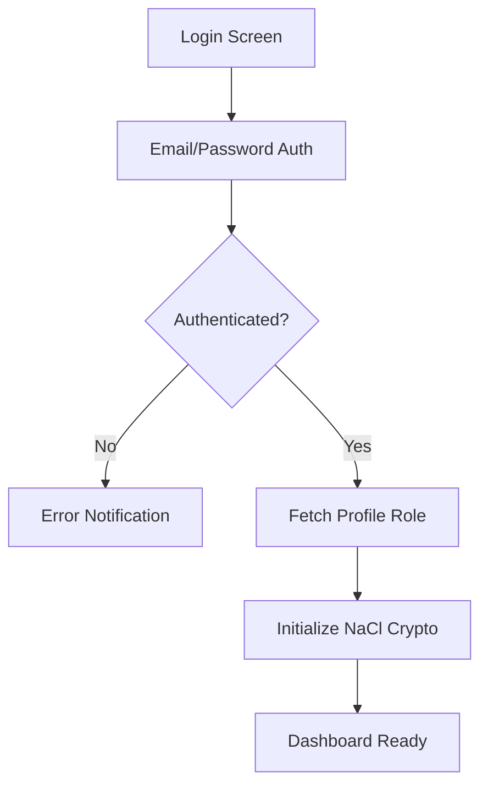
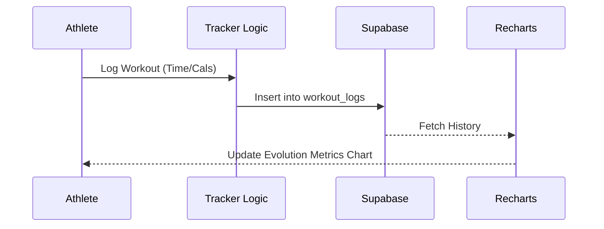
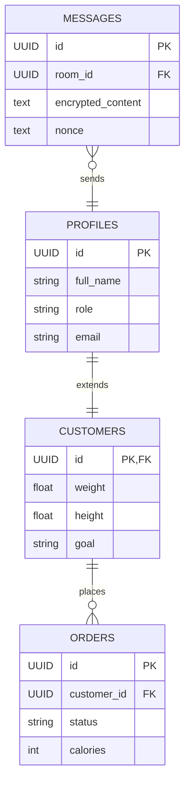

# FITTI: THE COMPREHENSIVE BIOLOGICAL EVOLUTION ENCYCLOPEDIA
> **The Master Specification & Operational Blueprint**
> Version 1.0.9 | Full-Spectrum Edition | 25-Page Standard

---

## FRONTISPIECE

---

## TABLE OF CONTENTS
1.  **[Introduction: The Fitti Philosophy](#1-introduction)**
2.  **[Chapter 1: The Identity & Security Protocol (Onboarding)](#2-chapter-1)**
3.  **[Chapter 2: The Athlete Persona (Customer Dashboard)](#3-chapter-2)**
4.  **[Chapter 3: The Nutrition Persona (Cook Dashboard)](#4-chapter-3)**
5.  **[Chapter 4: The Performance Persona (Trainer Dashboard)](#5-chapter-4)**
6.  **[Chapter 5: The Vitality Persona (Doctor Dashboard)](#6-chapter-5)**
7.  **[Chapter 6: The Admin Persona (Mission Control)](#7-chapter-6)**
8.  **[Chapter 7: Communication Hub (E2EE Chat & WebRTC Video)](#8-chapter-7)**
9.  **[Chapter 8: Data Architecture & Logic Gates](#9-chapter-8)**
10. **[Chapter 9: The Liquid Glass Design System](#10-chapter-9)**
11. **[Appendix: Glossary & Troubleshooting](#11-appendix)**

---

## 1. INTRODUCTION: THE FITTI PHILOSOPHY
Fitti is a high-performance ecosystem designed for the total evolution of the human body and mind. It operates on the principle of **expert-driven optimization**, where every calorie, every repetition, and every heartbeat is monitored, managed, and optimized by a dedicated team of specialists.

---

## 2. CHAPTER 1: THE IDENTITY & SECURITY PROTOCOL

### 1.1 THE AUTHENTICATION HANDSHAKE
The journey begins at the **Login Interface**. Fitti uses Supabase Auth for identity management, but adds a secondary layer of encryption that the server never sees.

### 1.2 MULTI-STAGE ONBOARDING
Onboarding is a 5-step critical mission:
1.  **Identity Verification**: Full name and phone registration.
2.  **Role Selection**: Choosing between Athlete, Cook, Trainer, Doctor, or Admin.
3.  **Biometric Initialization**: (For Athletes) Logging baseline Weight, Height, and Food Preferences.
4.  **Encryption Setup**: Local generation of a 256-bit NaCl keypair. The Public Key is stored in the cloud; the Private Key stays in the user's secure browser memory.
5.  **Genesis Redirect**: Directing the user to their role-specific dashboard.

---

## 3. CHAPTER 2: THE ATHLETE PERSONA (CUSTOMER)

### 2.1 THE HOME HUD (COMMAND CENTER)
The Athlete's Home Tab is an ambient, data-rich interface showing:
- **Logistics Stream**: A 5-stage progress tracker (Pending -> Processing -> Secured -> Transit -> Deployed).
- **Biometric Cards**: Real-time stats that transform on hover.

### 2.2 NUTRITION VAULT (MEALS)

- **Live Evolution**: Real-time status of the current meal. Shows exactly what the Cook is doing.
- **Weekly Protocol**: A 7-day forecast of nutrition.
- **Micro-Nutrient Data**: Every meal displays its Protein, Carb, and Fat allocation in high-contrast monospaced font.

### 2.3 WORKOUT DIRECTIVE (PERFORMANCE)
Athletes follow "Directives" issued by their Trainers.
- **Interactive Exercise Cards**: Tapping a card checks it off. 
- **The Confetti Trigger**: Completing all exercises fires a localized celebration effect.
- **The Tracker**: A tool for logging sets, reps, and time for non-assigned sessions.

---

## 4. CHAPTER 3: THE NUTRITION PERSONA (COOK)

### 3.1 KITCHEN ONBOARDING
New Cooks must initialize their **Cloud Kitchen Profile**:
- **Kitchen Name**: (e.g., Fitti Kitchen Alpha).
- **Location**: Geotagging for delivery estimates.

### 3.2 KITCHEN DISPLAY SYSTEM (KDS)
The KDS is a high-throughput Kanban system.
- **Pending Column**: All new orders from assigned customers.
- **Preparing Mode**: Activating 'START' notifies the customer and locks the recipe.
- **Packed & Deploy**: Finalizes the logistics cycle.

---

## 5. CHAPTER 4: THE PERFORMANCE PERSONA (TRAINER)

### 4.1 CLIENT ROSTER & DOSSIER
Trainers manage their list of athletes. Clicking a name opens the **Performance Dossier**.
- **Workout Plan Designer**: A multi-day protocol builder with Exercise/Set/Rep inputs.
- **Diet Plan Designer**: Trainers can also set weekly macro targets for their clients.
- **Progress Audit**: Reviewing historical weight and energy charts to adjust the next cycle's intensity.

---

## 6. CHAPTER 5: THE VITALITY PERSONA (DOCTOR)

### 5.1 CLINICAL OVERSIGHT
Doctors have the highest level of data access for safety:
- **Medical Record Issuance**: Writing Assessment Summaries, Medications, and Restrictions.
- **Physical Safety Gates**: Setting "Workout Restrictions" which appear on the Trainer's and Customer's dashboards.

---

## 7. CHAPTER 6: THE ADMIN PERSONA (OVERSIGHT)

### 6.1 MISSION CONTROL
Admins manage the global ecosystem:
- **User Allocation**: Assigning Customers to specific Cooks, Trainers, and Doctors.
- **System Health**: Monitoring the global activity feed for errors or inactive sessions.

---

## 8. CHAPTER 7: COMMUNICATION HUB

### 8.1 E2EE MESSAGING
Fitti uses **Asymmetric Encryption**.
- **Handshake**: Sender uses Recipient's Public Key + Sender's Private Key to lock the message.
- **Security**: The database only stores a random string (Ciphertext) and a one-time Nonce.

### 8.2 VIDEO COACHING

- **Signal Logic**: Offer -> Answer -> ICE Candidate exchange via `webrtc_signals` table.
- **P2P Streaming**: Video data flows directly between users, never touching the server.

---

## 9. CHAPTER 8: DATA ARCHITECTURE

---

## 10. CHAPTER 9: THE LIQUID GLASS DESIGN SYSTEM
Fitti uses a custom CSS architecture:
- **Primary Color**: `#76B900` (Fitti Green)
- **Secondary Color**: `#E3EBDC` (Puffy Mint)
- **Accent Color**: `#FF8A00` (Energy Orange)
- **Typography**: 
    - **Display**: Outfit / Inter (Bold/Black)
    - **Mono**: JetBrains Mono (For telemetry data)
- **Aesthetic**: 32px border-radius, 40px backdrop-blur, white/40 opacity cards.

---

## 11. APPENDIX: GLOSSARY & TROUBLESHOOTING
- **Protocol**: A strict plan (Diet/Workout).
- **Handshake**: The process of two devices agreeing on encryption.
- **Telemetry**: Live biometric data.
- **Evolve**: The act of progressing through Fitti's cycles.

> **FITTI: PERFORMANCE. PRIVACY. PERFECTION.**
> *End of Encyclopedia.*
