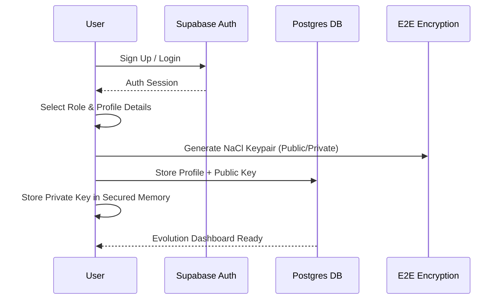
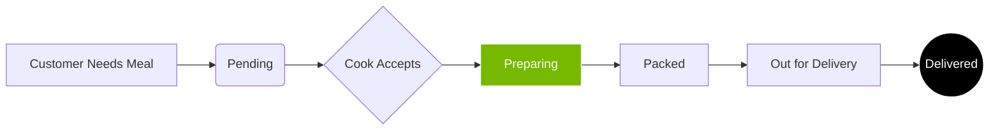

# FITTI: THE HIGH-PERFORMANCE EVOLUTION PLATFORM
> **Project Manifesto & Technical Blueprint**
> Version 1.0 | Stable Build

## 1. EXECUTIVE SUMMARY
**Fitti** is a premium, full-stack fitness and lifestyle evolution platform designed to bridge the gap between high-performance athletes (Customers) and their specialized support teams (Cooks, Trainers, and Doctors). 

Built with a "Liquid Glass" aesthetic and powered by a secure, real-time backend, Fitti provides a seamless ecosystem for biometric tracking, nutritional logistics, workout protocol execution, and military-grade encrypted communication.

---

## 2. THE ROLE-BASED ECOSYSTEM
Fitti operates on a 5-tier role system, each with specific permissions and specialized interfaces.

### 2.1 USER ROLES & PERMISSIONS
| Role | Objective | Key Capabilities |
| :--- | :--- | :--- |
| **Customer** | Evolution | Log biometrics, track workout/diet plans, chat with experts, and monitor meal deliveries. |
| **Cook** | Nutrition | Manage the Kitchen Display System (KDS), update order status (Preparing/Packed), and view dietary preferences. |
| **Trainer** | Performance | Design weekly workout protocols, monitor progress logs, and conduct video coaching sessions. |
| **Doctor** | Vitality | Review medical telemetry, issue health summaries, and provide clinical oversight. |
| **Admin** | Oversight | Global user management, system-wide analytics, and resource allocation. |

---

## 3. HOW IT WORKS: THE CORE WORKFLOWS

### 3.1 USER ONBOARDING & VERIFICATION
When a user joins Fitti, they undergo a specialized onboarding sequence that initializes their "Digital Twin" in our database.

### 3.2 THE ORDER LOGISTICS LIFECYCLE
The bridge between the **Cook** and the **Customer** is managed through a real-time Kanban system.

---

## 4. TECHNICAL ARCHITECTURE

### 4.1 THE BACKEND STACK
*   **Database**: Supabase (PostgreSQL) with Row-Level Security (RLS) ensuring data isolation.
*   **Real-time**: Postgres Changes (via WebSockets) for instant chat and order updates.
*   **Video Infrastructure**: WebRTC P2P signaling via `webrtc_signals` table for zero-latency sessions.
*   **Security**: NaCl (Networking and Cryptography library) for asymmetric End-to-End Encryption.

### 4.2 SECURITY: END-TO-END ENCRYPTION (E2EE)
Fitti uses the **Salsa20** and **Poly1305** algorithms via `tweetnacl` to ensure that even the database administrators cannot read your messages.

1.  **Key Generation**: During onboarding, a unique public/private keypair is generated on your device.
2.  **Encryption**: Messages are encrypted using the recipient's public key and your private key.
3.  **Decryption**: Only the recipient, using their private key and your public key, can unlock the message.
4.  **Zero-Knowledge**: The server only ever sees the "Ciphertext" (scrambled text) and a "Nonce" (one-time random number).

---

## 5. DATA INTELLIGENCE: SCHEMA MAP
The Fitti database is designed for high-performance retrieval and strict data integrity.

### 5.1 CORE TABLES
*   **`profiles`**: Central identity table linked to Auth.
*   **`customers`**: Extended biometric data (weight, height, goals).
*   **`orders`**: Real-time logistics tracking for meal plans.
*   **`diet_plans` / `workout_plans`**: JSONB structured protocols for nutrition and training.
*   **`medical_records`**: Protected clinical data accessible only by doctors and the patient.
*   **`messages`**: The encrypted transmission log.

---

## 6. USER MANUAL: FEATURE GUIDES

### 6.1 FOR CUSTOMERS
*   **The Hub**: Your central command center. View live order status and daily biometrics.
*   **Nutrition Vault**: View your active meal plan. Toggle between "Live Evolution" (today) and "Weekly Protocol".
*   **Workout Directive**: Check off assigned exercises. Completing a protocol triggers a system-wide achievement.
*   **Secure Channel**: Direct, encrypted link to your Cook, Trainer, and Doctor.

### 6.2 FOR COOKS
*   **Kitchen Display System (KDS)**: View all pending orders. Use the status toggle to move orders through the pipeline.
*   **Dietary Awareness**: Click on any order to see specific "Customer Preferences" (e.g., Vegan, Non-Veg).

### 6.3 FOR TRAINERS & DOCTORS
*   **Patient/Client Management**: Search through your assigned list of users.
*   **Protocol Assignment**: Create and update Workout/Diet plans that appear instantly on the customer's dashboard.
*   **Telemetry Review**: View historical weight/energy charts to make data-driven adjustments.

---

## 7. SYSTEM PERFORMANCE & LOGS
Fitti monitors all "Activity Feed" events to provide admins with a top-down view of the ecosystem's health without compromising individual user privacy.

> **Evolve your body. Secure your data. Master your performance.**
> *Fitti v1.0.0*
