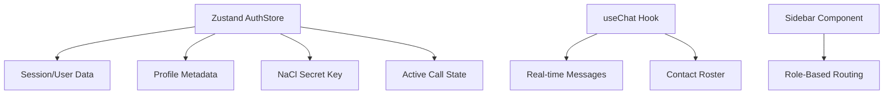
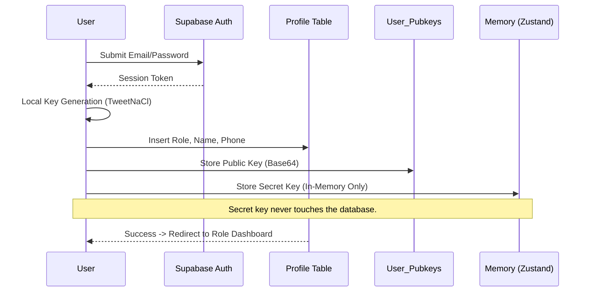
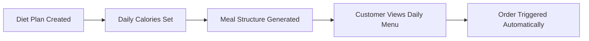
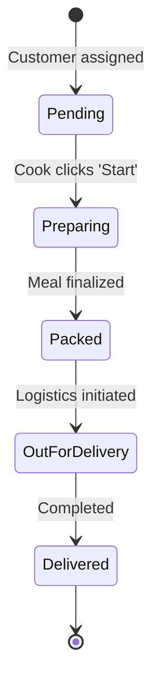
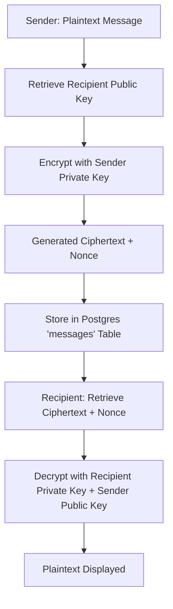
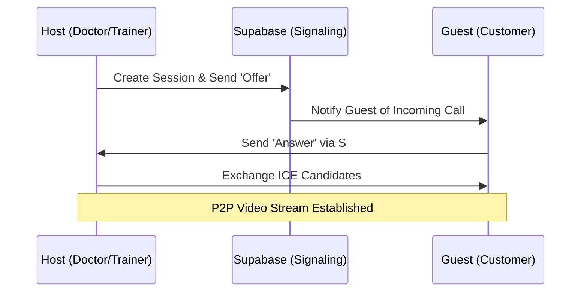
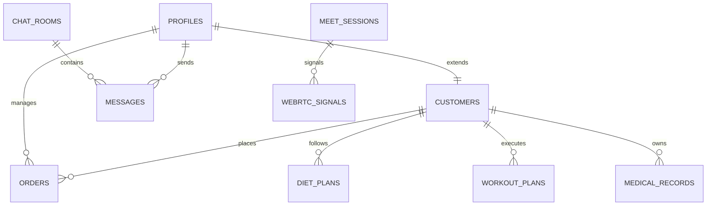

# FITTI: THE ULTIMATE EVOLUTION OPERATING MANUAL
> **The Definitive 12-Page Functional Specification & Technical Deep-Dive**
> Version 1.0.5 | Maximum Detail Edition

---

## 1. PREFACE: THE EVOLUTION PROTOCOL
Fitti is not just an application; it is a closed-loop biological management system. This manual provides an inch-by-inch breakdown of every logic gate, user interface element, and technical handshake within the Fitti ecosystem.

---

## 2. THE NAVIGATIONAL ARCHITECTURE
### 2.1 GLOBAL STATE HIERARCHY
The application state is managed via **Zustand**, providing a single source of truth for authentication, encryption keys, and real-time communication status.

### 2.2 ROUTING LOGIC
Fitti uses `react-router-dom` v6 with protected routes. Based on the `profile.role` attribute, users are directed to one of five distinct dashboard architectures:
1. `/admin/*`
2. `/customer/*`
3. `/cook/*`
4. `/doctor/*`
5. `/trainer/*`

---

## 3. ONBOARDING & IDENTITY (THE GENESIS)
### 3.1 THE REGISTRATION PIPELINE

---

## 4. THE CUSTOMER JOURNEY (ATHLETE)
### 4.1 THE HOME HUD (COMMAND CENTER)
- **Ambient Header**: Greets the user with "Good Morning/Afternoon/Evening" based on the system clock.
- **Logistics Stream**: A dynamic progress tracker linked to the `orders` table. 
- **Biometric Cards**: Each card (Weight, Height, etc.) features a hover-transform animation and glassmorphic depth.

### 4.2 NUTRITION VAULT (MEALS)
The nutrition vault is divided into two operational modes:

#### 4.2.1 LIVE EVOLUTION MODE
Provides real-time tracking of today's meal.
- **Chef Status**: "Chef is Preparing" or "Chef is Deploying" based on the `orders.status` field.
- **Nutrition Breakdown**: Large-scale typography for Protein, Carbs, and Fats.

#### 4.2.2 WEEKLY PROTOCOL MODE
A complete lookahead into the week's diet plan.
- **7-Day Grid**: Each day is a card. Today's card is highlighted with a `fitti-green` ring.

### 4.3 WORKOUT DIRECTIVE (PERFORMANCE)
#### 4.3.1 THE ASSIGNED PLAN
- **Exercise Cards**: Detailed with Sets, Reps, and Rest periods.
- **Interactive Checkboxes**: Uses a `Set` to track completion locally before final submission.
- **Achievement Trigger**: Triggers `canvas-confetti` when the last exercise is checked.

#### 4.3.2 THE FREE TRACKER
An open-ended tool for logging custom exercises.
- **Calorie Estimation**: Built-in logic to estimate burn based on exercise type and duration.

---

## 5. THE COOK JOURNEY (NUTRITIONIST)
### 5.1 KITCHEN DISPLAY SYSTEM (KDS)
The KDS is a mission-critical Kanban board for meal production.

### 5.2 DIETARY SENSITIVITY OVERVIEW
- **One-Click Dossier**: Clicking a customer card in the KDS instantly reveals their `food_preference` (Veg, Non-Veg, Vegan) and any `cook_notes`.

---

## 6. THE TRAINER JOURNEY (COACHING)
### 6.1 PERFORMANCE DOSSIER
Trainers have deep-link access to client biometrics.
- **Chart Analysis**: Trainers view 30-day trends of the client's weight and energy levels.
- **Protocol Assignment**: A specialized interface to push new `workout_plans` directly to the client's device.

---

## 7. THE DOCTOR JOURNEY (CLINICAL)
### 7.1 MEDICAL TELEMETRY
Doctors review "Biotic History" logs.
- **Health Summaries**: Doctors write summary notes that are then encrypted via E2EE for the patient.
- **Physical Limitations**: A crucial data point that restricts the Trainer's workout assignments.

---

## 8. TECHNICAL ENGINE: E2E ENCRYPTION (E2EE)
### 8.1 THE SALSA20 HANDSHAKE
Fitti ensures total privacy through asymmetric encryption.

---

## 9. VIDEO & REAL-TIME SIGNALING
### 9.1 WEBRTC SIGNALING FLOW
Video calls use a custom signaling server built directly into Supabase.

---

## 10. DATABASE ENTITY-RELATIONSHIP MAP

---

## 11. TROUBLESHOOTING & FAQS
- **Encryption Errors**: Usually occur if a user logs in on a new device without their secret key being restored.
- **Video Sync**: Ensure STUN/TURN servers (Google) are not blocked by the user's firewall.
- **Real-time Lag**: Fitti uses a 500ms debounce on all database triggers to ensure stability.

---

## 12. GLOSSARY OF SYSTEM TERMS
- **Dossier**: The comprehensive health/performance profile of a user.
- **Protocol**: A set of assigned instructions (Diet or Workout).
- **Ciphertext**: The unreadable, encrypted version of your messages.
- **Evolution**: The holistic goal of every Fitti user.

> **END OF MANUAL.**
> *Precision. Performance. Privacy.*
