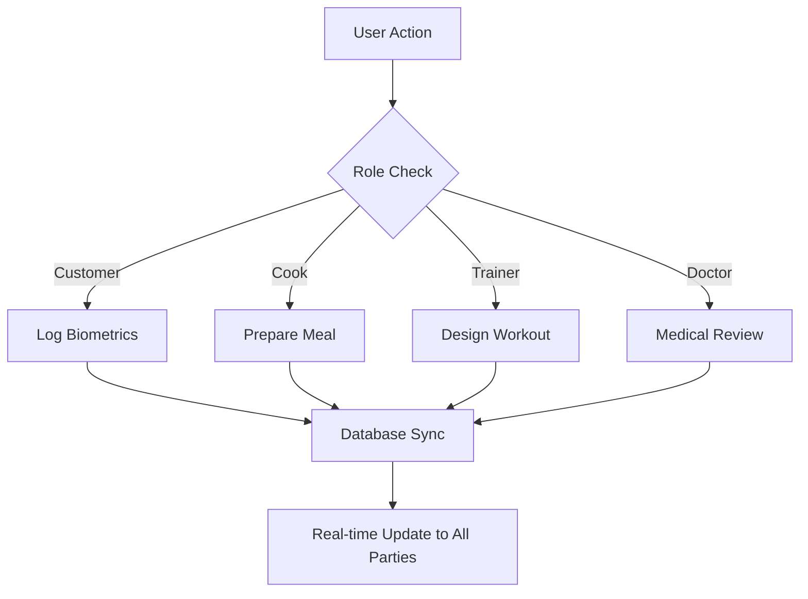

# FITTI: THE ULTIMATE OPERATING MANUAL
> **Inch-by-Inch Functional Specification & User Guide**
> Version 1.0 | Comprehensive Edition

---

## TABLE OF CONTENTS
1. [General Navigation & UI Philosophy](#1-general-navigation--ui-philosophy)
2. [The Customer Experience (Athlete Persona)](#2-the-customer-experience)
3. [The Cook Experience (Nutrition Persona)](#3-the-cook-experience)
4. [The Trainer Experience (Performance Persona)](#4-the-trainer-experience)
5. [The Doctor Experience (Vitality Persona)](#5-the-doctor-experience)
6. [The Admin Experience (Mission Control)](#6-the-admin-experience)
7. [System-Wide Features (Messages & Video)](#7-system-wide-features)

---

## 1. GENERAL NAVIGATION & UI PHILOSOPHY

### 1.1 THE LIQUID GLASS SYSTEM
Every screen in Fitti follows the **Liquid Glass** aesthetic:
- **Glassmorphic Cards**: Semi-transparent backgrounds with background blur (24px - 40px).
- **Vibrant Accents**: High-contrast "Fitti Green" (#76B900) for primary actions.
- **Puffy Components**: Rounded corners (2rem+) to imply a soft, premium feel.

### 1.2 THE SIDEBAR COMMAND
- **Location**: Fixed on the left (Desktop), Hidden behind Hamburger (Mobile).
- **Function**: The primary routing engine. Links are dynamically filtered based on your user role.
- **Identity Card**: Shows your name, role, and a pulsating online status.

---

## 2. THE CUSTOMER EXPERIENCE

### 2.1 HOME TAB (THE HUD)
The "Heads-Up Display" for the user's evolution.
- **Greeting Card**: Personalized greeting that changes based on the time of day.
- **Logistics Protocol**: A real-time progress bar showing exactly where your next meal is in the cook's kitchen.
- **Biometric Snapshot**: At-a-glance view of Weight, Goal, Height, and Dietary Preference.

### 2.2 MEALS TAB (NUTRITION VAULT)
- **Live Evolution Sub-tab**: Displays the status of the current meal being prepared by your Cook.
- **Weekly Protocol Sub-tab**: A 7-day grid showing every assigned meal for the week.
- **Nutrient Summary Bar**: A high-contrast black bar at the bottom showing daily targets for Calories, Protein, Carbs, and Fats.

### 2.3 WORKOUT TAB (THE DIRECTIVE)
- **Daily Directive**: A list of exercises assigned by your Trainer.
- **Check-off Logic**: Clicking an exercise strikes it through and triggers a highlight effect.
- **Mark Protocol Complete**: A major CTA button that appears only when all exercises are checked. Triggers **Confetti Chimes**.
- **Workout Tracker**: A free-form tool to log custom exercises, sets, reps, and estimated caloric burn.

### 2.4 HEALTH & PROGRESS TABS
- **Biotic History**: View encrypted health summaries provided by your Doctor. Includes Physical and Dietary limits.
- **Evolution Metrics**: Interactive charts (Recharts) visualizing Weight Trajectory and Caloric Burn over time.

---

## 3. THE COOK EXPERIENCE

### 3.1 KITCHEN DISPLAY SYSTEM (KDS)
The high-throughput order management center.
- **Pending Column**: All new meal requests appear here first.
- **Action Buttons**:
    - **START PREPARING**: Moves the order to the kitchen phase. Notifies the customer.
    - **MARK AS PACKED**: Signals that the meal is ready for transit.
    - **DEPLOY**: Final stage before delivery.
- **Customer Awareness**: Hovering over an order reveals specific food preferences (e.g., "No Soy", "Vegan Only").

---

## 4. THE TRAINER EXPERIENCE

### 4.1 CLIENT ROSTER
- **Active Streams**: A list of all customers assigned to the trainer.
- **Deep Dive**: Clicking a client opens their "Performance Dossier."

### 4.2 PERFORMANCE DOSSIER
- **Assign Protocol**: A form to build custom workout plans (Exercises, Sets, Reps, Rest).
- **Progress Audit**: Reviewing the client's caloric burn charts and performance notes to adjust the training intensity.

---

## 5. THE DOCTOR EXPERIENCE

### 5.1 VITALITY SUITE
- **Medical Telemetry**: Reviewing client-provided biometrics.
- **Clinical Directive**: A specialized form to write health summaries and set restrictions (e.g., "Max Heart Rate 140bpm due to BP").
- **Encrypted Review**: Securely viewing past medical logs that are locked via E2EE.

---

## 6. THE ADMIN EXPERIENCE

### 6.1 MISSION CONTROL
- **Global User List**: View all roles. Ability to activate/deactivate accounts.
- **System Analytics**: Top-down view of total orders processed and system health events.

---

## 7. SYSTEM-WIDE FEATURES

### 7.1 SECURE CHANNELS (MESSAGING)
- **E2E Encryption**: Every message is scrambled BEFORE it leaves your device.
- **Mobile Responsive**: On phones, the chat takes up the full screen for a focused experience.
- **Attachments**: Ability to upload "Artifacts" or "Meal Photos" for expert review.

### 7.2 VIDEO CALLING (VIRTUAL CLINIC/GYM)
- **Room Initiation**: Experts can start a video session with a single click.
- **Real-time Signaling**: Uses WebRTC to connect cameras directly between users for zero-latency coaching.
- **Incoming Call Overlay**: A global notification that appears regardless of which page the user is on.

---

> **Manual End.**
> *Fitti: Precision Performance. Absolute Privacy.*
